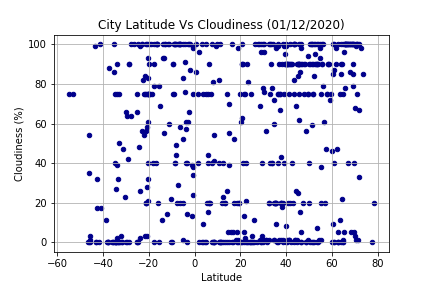
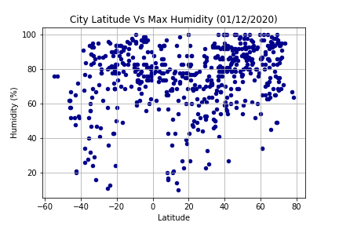
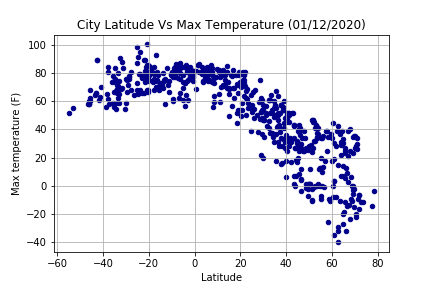
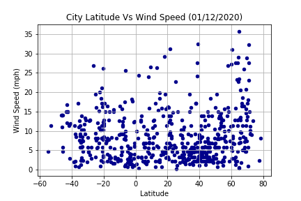

# python-api-challenge
Created a Python script to visualize the weather of 500+ cities across the world of varying distance from the equator. Built the series of scatter plots to showcase various relationships



---------------------------------


---------------------------------


---------------------------------


---------------------------------
# Key trends observed
```
Based on the random data of cities obtained, following observations can be made:
1. As we move towards equator the temperature gets warmer
2. As you move away from the equator towards the NORTH (positive latitude) the temperature drops or cools down more than as compared to the temperature going SOUTH (negative latitude). NOTE: This might be because we have Max temperature taken into consideration.
3. The latitude has no discernible relationship with cloudiness & wind speed
